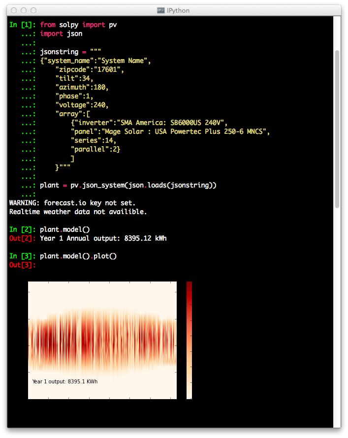
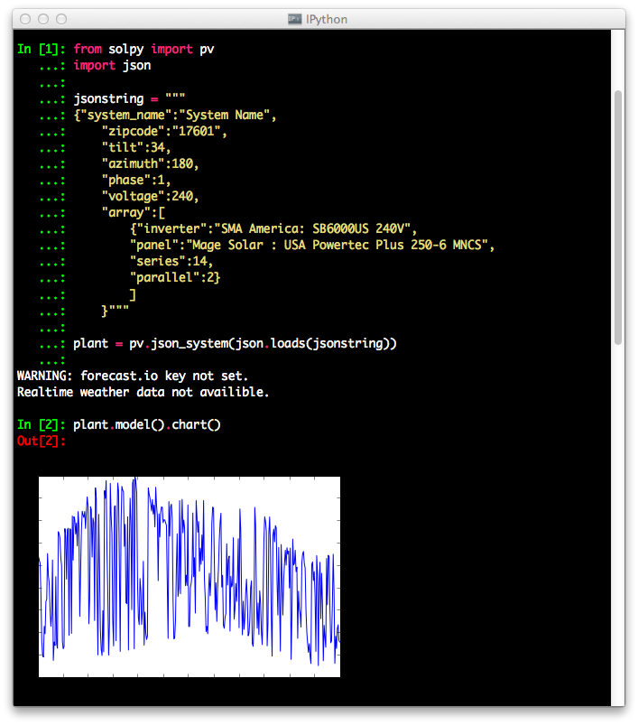
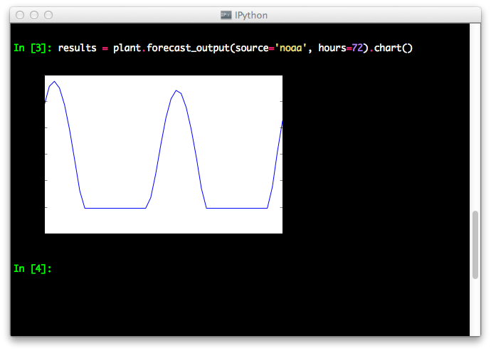

Quickstart
===========

This is an example of modeling systems annual performance with no shade.

.. highlight:: python
.. code-block:: python

    from solpy import pv
    import json

    jsonstring = """
    {"system_name":"System Name",
        "zipcode":"17601",
        "tilt":34,
        "azimuth":180,
        "phase":1,
        "voltage":240,
        "array":[
            {"inverter":"SMA America: SB6000US 240V",
            "panel":"Mage Solar : USA Powertec Plus 250-6 MNCS",
            "series":14,
            "parallel":2}
            ]
        }"""

    plant = pv.json_system(json.loads(jsonstring))
    print plant.model()
    #Year 1 Annual _output: 8395.12 kWh

Annual Output can be plotted.

Annual output can also be charted.

It is also possible to do some basic forecasting using NOAA GFS or forecast.io

